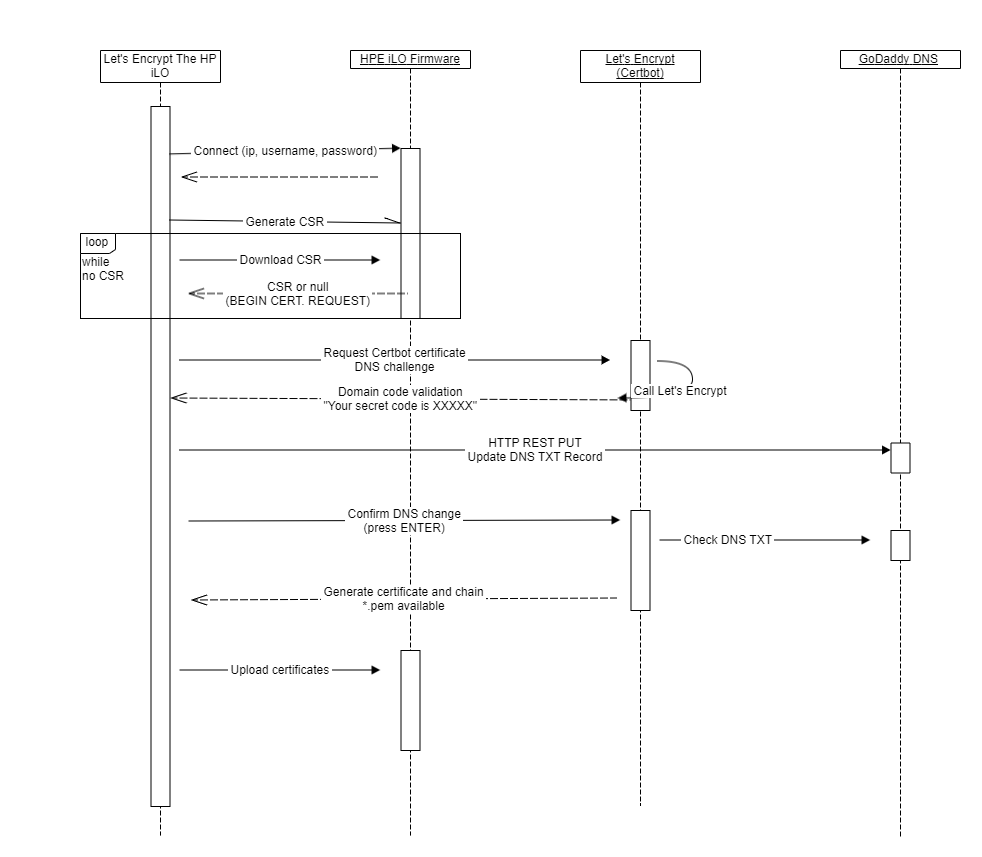

# Let's Encrypt HPE iLO (with GoDaddy DNS verification)

Or... if you wish... `Let's Encrypt The iLO`

This set of Powershell scripts helps automate the process of issuing Let's Encrypt SSL certificates for HPE iLO firmwares using Windows and PowerShell.

# Prerequisites

1. Make sure you are running in the same LAN (or VPN) as the machine(s) you want to upgrade. Note that the self-enrollment may not work as explained later
1. Make sure your HPE iLO has a public DNS. It doesn't matter whether it resolves to a local address
1. Obtain a [GoDaddy API Key](https://developer.godaddy.com/getstarted)
1. Install [Certbot for Windows](https://certbot.eff.org/lets-encrypt/windows-other.html)
1. Install the HPE iLO Powershell Module

```
    Install-Module -Name HPEiLOCmdlets
```


# Getting started

1. Edit the CSR information as displayed below, do this only once

```
    $certificate = @{
        Country = "<COUNTRY>";
        State = "<STATE>";
        City = "<CITY>";
        Organization = "<ORGANIZATION>";
        OrgUnit = "<ORGUNIT>";
    };
```

2. For this revision of the scripts, also edit the secret parameters in both the `.ps1` files accordingly. You can't yet edit the DNS challenge

letsencrypthpeilo.ps1

    $hpIloHost = "<ILO HOST NAME>"
    $hpIloUsername="<ADMIN USER>"
    $hpIloPassword="<ADMIN PASSWORD>"

godaddy-dns.ps1

    
    $goDaddyApi="<APIKEY>"
    $goDaddySecret="<APISECRET>"
    $hpIloHost = "<ILO HOST>"

3. From a first Powershell terminal, run

    .\letsencrypthpeilo.ps1

4. While the script waits, expect a `.crt` file in the same directory. From a second terminal run

    certbot certonly --csr .\[servername].csr -d [servername] --manual --preferred-challenges dns --cert-path [servername].crt

5. At this point, Certbot will show you a challenge DNS code that you must publish on DNS, and wait for you. Copy that code and replace in `godaddy-dns.ps1`

    $dnsChallenge = "<REPLACE DNS CHALLENGE FROM CERTBOT>"

6. From a third terminal, run the following

    .\godaddy-dns.ps1

7. You can make sure that the DNS is up to date by running `Resolve-DnsName -Type TXT -Name <ILO HOST NAME>` and check the result. This may take a couple of minutes to refresh

8. Once you are good with the DNS, go to the second terminal (step 5) and press `ENTER` key. Certbot will complete

9. The first terminal should now complete and save the certificate into hardware

# Renewal procedure

TBD


## Note about self-enrollment

If you attempt to run the scripts from the same hardware running the iLO, you could find that it is not possible. I found that using the shared LAN port is not possible. It means that the OS ran by the HPE hardware cannot access its own firmware's IP address. See [this topic](https://serverfault.com/questions/711127/hp-proliant-shared-ilo-port-do-not-answer-to-host). Using a different computer works. Using dedicated iLO port is likely to.


# Background

## What is the iLO? What is the deal with SSL?

If you own an HP Enterpise (HPE) server or microserver hardware, you probably know what the [Integrated Lights Out](https://www.hpe.com/uk/en/servers/integrated-lights-out-ilo.html) (iLO) is.
It's a huge firmware designed to manage your machine over HTTPS or SSH.

The iLO is also found in cheaper SOHO appliances like the Microserver Gen8 that I own, which acts as great NAS tool, and is affordable for home usage. Sorry, I didn't want to promote HPE but I am involuntarily doing it...

One of the features of the iLO firmware is SSL certificate. As soon as you start your appliance for the first time, the embedded web server will use a self-signed certificate.
In order to unleash the full power of remote management of server machines, you either trust the firmware certificate, or request the issue of production SSL certificates.

Let's Encrypt is a free CA for production use.

In order to install an SSL certificate on iLO, you either need to use the HTTP user interface of the firmware, or... automate the process!

## How does iLO use SSL Certificates?

iLO contains a hardware key store used for the private key. The key never leaves the appliance. You need to get its public key, more precisely its **Certificate Signing Request** to obtain a valid certificate by Let's Encrypt. You also need Let's Encrypt to validate your domain, but you will immediately find out that the HTTP challenge is no use, so we are going to use the DNS challenge. This set of tools is designed for use with GoDaddy DNS provider


## What about GoDaddy DNS?

In order to pass the Certificate DNS Challenge by Let's Encrypt, you must prove you own the domain name by publishing a special TXT DNS record with data provided by Let's Encrypt during the enrollment. As soon as the CA finds the DNS record exists and matches their supplied value, they will issue a certificate for your appliance.

GoDaddy provides both with a user-friendly control panel and REST APIs for automation use. Here, we are leveraging the DNS APIs to publish a DNS record. This document does not cover how to obtain an API key from GoDaddy. You will need one to run the scripts.

## How it works



The above diagram shows the simple and bright idea 💡 behind the scripts here

Basically the HP iLO has HTTP APIs to generate a Certificate Signing Request (CSR) and to upload a certificate from the external. This is what HPEiLOCmdlets is for.

At the first step, the script will login to iLO as Administrator and ask the firmware to generate a keypair and a CSR. The operation is asynchronous so we'll need to do some polling. The goal of the first step is to download the CSR and place it in the same directory as we are running. The script will wait for the new certificate.

Secondarily, the user will want to run `certbot` from EFF to initialize Let's Encrypt certificate request. The parameters will ask Certbot to use the supplied CSR and not to generate its own. Certbot will submit the CSR to Let's Encrypt and negotiate a DNS challenge key. And wait for the DNS to be online.

At the third step, the GoDaddy DNS updater will ask GoDaddy to update the DNS zone of the target domain with the target string as required by Let's Encrypt DNS challenge.

Back to Certbot, once Let's Encrypt validates the DNS challenge and authenticate domain ownsership, it will release a certificate that will be stored in the same directory as the scripts here.

Back to the main script, once the certificate file will be present in the script's directory, it will use HPE iLO APIs to upload the certificate and issue a firmware reset.

After reset, the iLO will show the classic certificate info on the browser when queried.

# Future developments

Follow the issues, as I am myself updating on my *desiderata*.

The goal is a fully automated script that will coordinate HPE iLO with Certbot and GoDaddy verification APIs. Note that I will continue to actively use these scripts because I don't like buying a 6€ certificate when I can get one for free.

# Contributing

Please open issues or pull requests.

# Code of conduct

Usual stuff, serious stuff. Okay you know the rules. Please be polite and respectful of others. I don't care you gender or skin colour, I care about what positve feedback you can give to this small project. Be criticist, with respect.